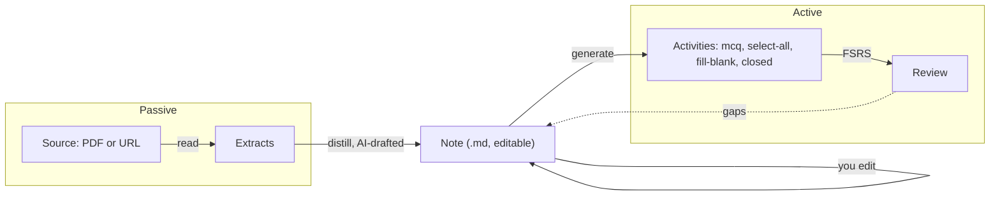
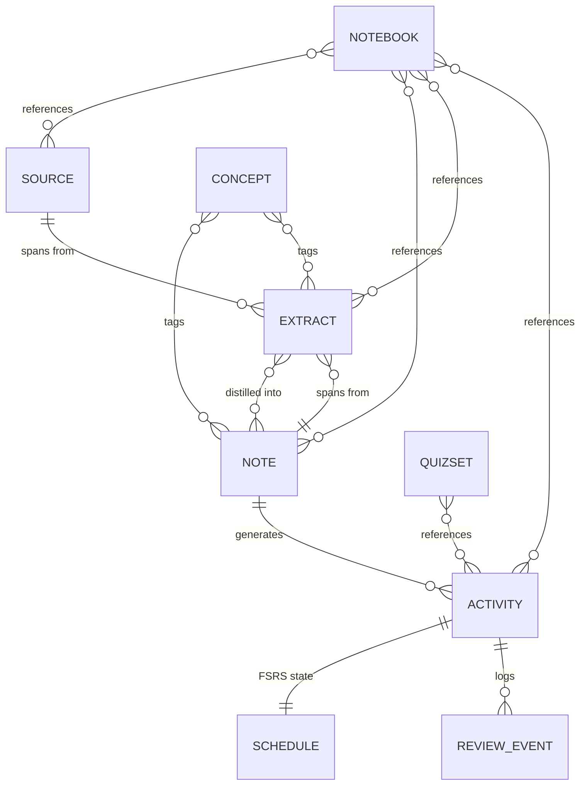
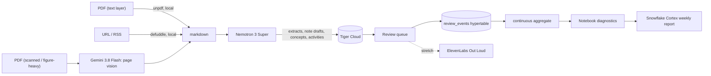
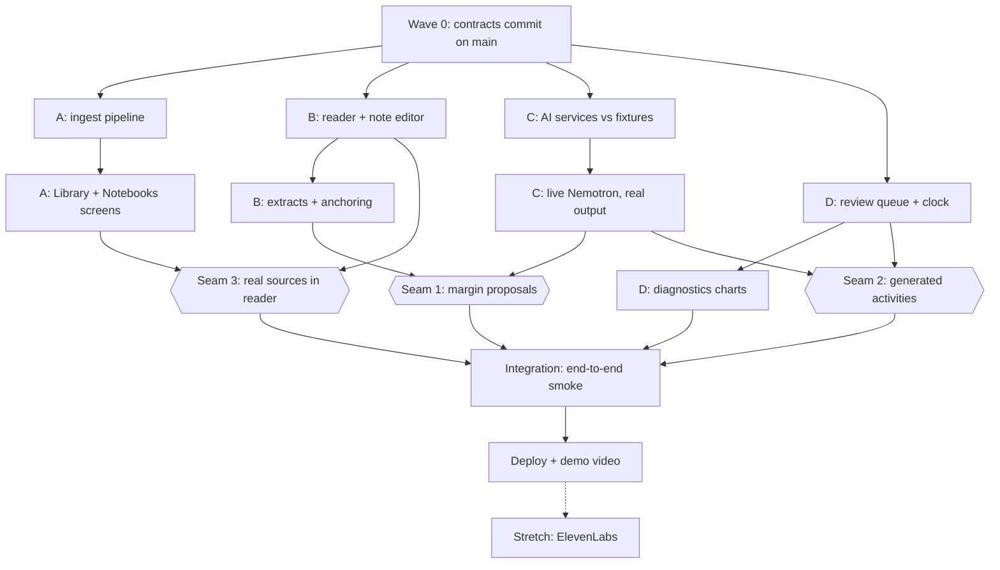

# Incremental Reading Hackathon Build Plan

## What we are building

A "lightweight Obsidian" for incremental reading. You add a PDF or a URL, the app converts it to markdown, AI proposes passages worth keeping (extracts), you distill those into markdown **notes**, and notes or deliberate manual clozes become gradeable activities scheduled with FSRS. Notebooks are saved collections of references, so one source or activity appears in many notebooks. Each notebook shows diagnostics: what you know, what you are struggling with, what you have not touched.

## The note is the pivot, not a pipeline format

The markdown note is the real artifact and the point where the human intervenes for AI-generated study material. Passive reading produces extracts; active recall consumes activities; **the note is the editable bridge for AI generation.** AI may draft a note from extracts, but it is always human-readable markdown the user can rewrite, and AI-generated activities come from the note *as edited*. A deliberate manual cloze is itself a human intervention and may instead use an extract as its parent.



Three consequences for the build:

- AI never generates an activity directly from a source or extract. A deliberate manual cloze can create or reuse an extract and derive directly from it.
- Note edits should mark downstream activities stale and offer regeneration, rather than silently diverging.
- This is also the best answer to "is this just an AI wrapper?" The human edit step is the product, and the demo should show someone rewriting an AI-drafted note before being quizzed on it.

Reference material: the existing [obsidian-incremental-reading](https://github.com/RecursiveFunctions/obsidian-incremental-reading) plugin. Reuse its concept model directly - topic/extract/item, 0-100 priority where lower floats to the top, FSRS via `ts-fsrs`, mercy postpone, and the re-anchor/detach/orphan flow.

Two research briefs are already committed and are the source of truth for API details: [docs/hackathon-sponsor-api-brief.md](docs/hackathon-sponsor-api-brief.md) and [docs/tigerdata-digitalocean-snowflake-api-brief.md](docs/tigerdata-digitalocean-snowflake-api-brief.md).

## Reconciliation with the team README

This plan was drafted before the `HelloWord` planning README was available, and the two disagreed
in five places. Resolved here as follows; each is a decision the team can overturn.

- **Hosting is Vercel, not DigitalOcean App Platform.** Changed throughout. DigitalOcean still
  earns its track through Gradient serverless inference (which hosts Nemotron) and Spaces for PDF
  storage, so the prize stays in reach without contradicting the hosting decision.
- **PWA and offline review.** The README specifies a progressive web app with `ts-fsrs` running on
  the device. This plan is server-authoritative: FSRS state lives in the `schedule` table and
  grading goes through `POST /api/review/grade`. **Recommended resolution: ship
  server-authoritative, keep the app installable, and treat true offline review as a stretch.**
  Server-side review events are what feed the TigerData hypertable and the diagnostics screen, and
  that is our strongest sponsor story. An offline client can sync events up later without changing
  the contracts. If the team wants genuine offline-first instead, the contracts layer needs
  rewriting around client-owned FSRS state and an event sync queue - decide before wave 0, not after.
- **Solana is dropped and ElevenLabs is demoted to a stretch goal**, superseding the README's
  track list. Voice is no longer its own workstream.
- **Workstream names.** The README's Pipeline / Core app / Multimodal+voice / Platform map onto
  this plan's A / B+D / C / A respectively. Since voice is demoted, the four-way split here is
  rebalanced around the note pipeline instead. Annotated in the ownership section below.
- **RSS is first-class in the README's pitch** but scheduled late here. It is genuinely small once
  ingest exists - `feedsmith` plus the existing URL path - so promote it if the pitch leans on it.

Reused code from the Obsidian plugin carries a header with the source repo URL, commit hash, and
MIT license, per the README's stated policy. Concepts are free; copied files get attribution.

## Caveat on the PDF

The event is **SteelHacks XIII**. Its rules PDF never reached the environment this plan was
written in, and neither the Devpost page nor search would surface the track briefs. So the
readings of Xtract, Compound, Seed Round, Beyond the Chatbot, and Out Loud below are inferred
from their names alone. Check each against the official brief before building a narrative on it -
these are the cheapest possible things to get wrong.

## The one architectural decision that de-risks everything

**Every source becomes markdown at ingest. Nothing downstream of ingest ever sees a PDF or raw HTML.**

This is a hard invariant, not a convention:

- A source cannot reach `ingest_status = 'ready'` with a null `markdown`. The schema enforces it.
- The extract pipeline reads `source.markdown` and nothing else. No code outside `lib/ingest/*` opens `storage_key`, fetches `origin_uri`, or parses HTML.
- The reader renders markdown. There is no pdf.js text layer anywhere in the app.

Why it matters: anchoring highlights in a live PDF requires the server's extracted page text and the browser's pdf.js text layer to agree on character offsets exactly, and that is the single most likely thing to consume a night. Collapsing to markdown means one content type, one editor, one anchoring implementation for PDFs, URLs, and hand-written notes alike. Keep the original PDF in Spaces so you can add a side-by-side viewer later, but it is decoration, never a data path.

It also gives the parallel split a clean seam: **workstream A's entire job is "anything in, markdown out."** B, C, and D can be written as if markdown were the only input format the product ever had, and they can be built against seeded markdown before A's ingester exists.

## Screens

Four navigation destinations, with the reader as a route opened from the other three:

- **Notebooks** (home) - grid of notebooks with due counts and a mastery sparkline.
- **Notebook detail** - diagnostics dashboard plus the sources, extracts, and activities it references.
- **Library** - everything that exists, globally: sources, notes, extracts, activities, concepts. Filterable, multi-select, "add to notebook".
- **Review** - the FSRS queue, plus quiz mode for doing a set at once.
- `/read/[id]` - the reading surface. Reached from Library, Notebook, or Review, not a nav tab. Two panes: source markdown on the left with extracts highlighted, the **note editor** on the right. This is where the passive-to-active handoff happens, so it deserves the most design attention of any screen.

## Data model

Every membership is a join table, so nothing is owned by a notebook.



Key columns:

- `source` - kind (`pdf` | `url`), original URI, Spaces key, extracted markdown, ingest status. Read-only once ingested.
- `extract` - source or note ref, markdown body, priority 0-100, and a **selector bundle** (`exact`, `prefix`, `suffix`, `start`, `end`) rather than editor positions. Embedding `vector(768)`.
- `note` - **the central table.** Title, markdown body, `origin` (`human` | `ai_drafted` | `ai_edited`), `body_hash`, updated-at. Embedding `vector(768)`.
- `extract_note` - join table, because one extract can feed several notes and one note can distill many extracts.
- `activity` - type (`mcq` | `select_all` | `fill_blank` | `closed`), payload, exactly one **parent note or extract**, nullable `source_body_hash` so a note edit marks note-backed activities stale, optional `variant_of` for synthetic variants.
- `review_event` - **the hypertable.** `time`, activity id, rating, concept id, elapsed, stability, difficulty. Append-only.

`source` and `note` are deliberately different tables even though both hold markdown: sources are immutable imports, notes are user-owned and editable. AI generation is note-only; explicit manual clozes may be extract-backed.

## Parallel development: contracts first

Four branches can only run safely if the shared shapes are frozen before anyone starts. The rule is: **`db/schema.sql`, `lib/contracts/*`, and `lib/api.ts` land on `main` in one commit before any feature branch is cut.** After that, nobody edits those files on a feature branch. A contract change is its own small PR to `main` that everyone rebases onto, announced to the team.

### Frozen file: `db/schema.sql`

```sql
create extension if not exists vectorscale cascade;   -- pulls in pgvector

-- immutable imported reading material
create table source (
  id            uuid primary key default gen_random_uuid(),
  kind          text not null check (kind in ('pdf','url')),
  title         text not null,
  origin_uri    text not null,
  storage_key   text,                      -- Spaces key, pdf only
  markdown      text,                      -- null until ingested
  ingest_status text not null default 'pending'
                check (ingest_status in ('pending','processing','ready','failed')),
  ingest_method text check (ingest_method in ('unpdf','defuddle','gemini_vision','gemini_url')),
  ingest_error  text,
  word_count    int,
  created_at    timestamptz not null default now(),
  -- the invariant: nothing is readable or extractable until it is markdown
  constraint source_ready_implies_markdown
    check (ingest_status <> 'ready' or markdown is not null)
);

-- the pivot: human-readable, human-editable
create table note (
  id         uuid primary key default gen_random_uuid(),
  title      text not null,
  body_md    text not null default '',
  body_hash  text not null,                -- sha256(body_md), maintained by the app
  origin     text not null default 'human'
             check (origin in ('human','ai_drafted','ai_edited')),
  embedding  vector(768),
  created_at timestamptz not null default now(),
  updated_at timestamptz not null default now()
);

create table extract (
  id            uuid primary key default gen_random_uuid(),
  source_id     uuid references source(id) on delete cascade,
  note_id       uuid references note(id)   on delete cascade,
  body_md       text not null,
  priority      int  not null default 50 check (priority between 0 and 100),
  selector      jsonb not null,            -- SelectorBundle
  anchor_status text not null default 'anchored'
                check (anchor_status in ('anchored','orphaned','detached')),
  suggested_by  text not null default 'human' check (suggested_by in ('human','nemotron')),
  accepted      boolean not null default true,
  embedding     vector(768),
  created_at    timestamptz not null default now(),
  check (num_nonnulls(source_id, note_id) = 1)   -- an extract has exactly one parent
);

create table extract_note (                 -- many extracts distil into many notes
  extract_id uuid references extract(id) on delete cascade,
  note_id    uuid references note(id)    on delete cascade,
  primary key (extract_id, note_id)
);

create table activity (
  id               uuid primary key default gen_random_uuid(),
  note_id          uuid not null references note(id) on delete cascade,
  type             text not null check (type in ('mcq','select_all','fill_blank','closed')),
  payload          jsonb not null,          -- ActivityPayload, discriminated on type
  source_body_hash text not null,           -- note.body_hash at generation time
  variant_of       uuid references activity(id),
  created_at       timestamptz not null default now()
);

-- staleness is derived, never stored
create view activity_v as
  select a.*, (a.source_body_hash <> n.body_hash) as stale
  from activity a join note n on n.id = a.note_id;

-- column names map 1:1 onto the ts-fsrs Card interface
create table schedule (
  activity_id    uuid primary key references activity(id) on delete cascade,
  due            timestamptz not null,
  stability      double precision not null default 0,
  difficulty     double precision not null default 0,
  elapsed_days   int not null default 0,
  scheduled_days int not null default 0,
  learning_steps int not null default 0,
  reps           int not null default 0,
  lapses         int not null default 0,
  state          smallint not null default 0,   -- ts-fsrs State enum
  last_review    timestamptz,
  -- per-card interval multiplier, SuperMemo's A-factor in spirit.
  -- 1.0 = whatever FSRS said. <1 shows it more often, >1 less often.
  a_factor       double precision not null default 1.0
                 check (a_factor between 0.1 and 5.0)
);

-- user-tunable scheduling. one row per user; single-row for the hackathon.
create table scheduler_profile (
  id                uuid primary key default gen_random_uuid(),
  name              text not null,
  request_retention double precision not null default 0.90
                    check (request_retention between 0.70 and 0.98),
  maximum_interval  int not null default 36500,
  learning_steps    text[] not null default '{1m,10m}',
  relearning_steps  text[] not null default '{10m}',
  enable_fuzz       boolean not null default true,
  -- global multiplier applied on top of every card's own a_factor
  interval_modifier double precision not null default 1.0
                    check (interval_modifier between 0.01 and 5.0),
  -- length of one FSRS "day" in real milliseconds. 86400000 = normal.
  -- lower it to compress the whole schedule for a demo.
  day_ms            bigint not null default 86400000
                    check (day_ms between 250 and 86400000),
  created_at        timestamptz not null default now()
);

create table review_event (
  time           timestamptz not null default now(),
  activity_id    uuid not null,
  note_id        uuid not null,
  concept_id     uuid,
  rating         smallint not null,             -- ts-fsrs Rating 1..4
  state          smallint not null,
  elapsed_days   int not null,
  scheduled_days int not null,
  stability      double precision not null,
  difficulty     double precision not null,
  duration_ms    int,
  mode           text not null default 'queue' check (mode in ('queue','quiz','voice'))
) with (tsdb.hypertable, tsdb.partition_column = 'time', tsdb.chunk_interval = '1 day');

create table concept (
  id        uuid primary key default gen_random_uuid(),
  label     text not null unique,
  embedding vector(768)
);
create table concept_note    (concept_id uuid references concept(id) on delete cascade,
                              note_id    uuid references note(id)    on delete cascade,
                              primary key (concept_id, note_id));
create table concept_extract (concept_id uuid references concept(id) on delete cascade,
                              extract_id uuid references extract(id) on delete cascade,
                              primary key (concept_id, extract_id));

create table notebook (
  id          uuid primary key default gen_random_uuid(),
  name        text not null,
  description text,
  color       text,
  created_at  timestamptz not null default now()
);

-- polymorphic on purpose: the Library screen reads notebook contents in one query
create table notebook_item (
  notebook_id uuid not null references notebook(id) on delete cascade,
  item_type   text not null check (item_type in ('source','note','extract','activity')),
  item_id     uuid not null,
  added_at    timestamptz not null default now(),
  primary key (notebook_id, item_type, item_id)
);

create table quizset (
  id         uuid primary key default gen_random_uuid(),
  name       text not null,
  kind       text not null check (kind in ('flashcards','quiz')),
  created_at timestamptz not null default now()
);
create table quizset_activity (
  quizset_id  uuid references quizset(id) on delete cascade,
  activity_id uuid references activity(id) on delete cascade,
  position    int not null,
  primary key (quizset_id, activity_id)
);

create index extract_embedding_idx on extract using diskann (embedding vector_cosine_ops);
create index note_embedding_idx    on note    using diskann (embedding vector_cosine_ops);
create index schedule_due_idx      on schedule (due);

-- ships in the contracts commit so C and D can both read it from hour zero
create materialized view review_daily
with (timescaledb.continuous) as
select time_bucket('1 day', time) as bucket,
       concept_id,
       count(*)                                   as reviews,
       count(*) filter (where rating >= 2)        as recalled,
       avg(stability)                             as avg_stability,
       avg(difficulty)                            as avg_difficulty,
       avg(duration_ms)                           as avg_duration_ms
from review_event
group by bucket, concept_id;

select add_continuous_aggregate_policy('review_daily',
  start_offset      => interval '90 days',
  end_offset        => interval '1 hour',
  schedule_interval => interval '1 hour');
```

Retention counts Hard or better as a recall, matching the existing plugin's stats panel. Say so in the UI.

`notebook_item` trades foreign-key integrity for a single-query Library screen and one code path for "add anything to a notebook". That is the right call at hackathon speed; enforce the reference in the API layer.

### Frozen file: `lib/contracts/activity.ts`

This is the highest-traffic contract in the system - workstream C writes it, workstream D renders and grades it, and neither needs to read the other's code.

```ts
import { z } from 'zod'

export const Mcq = z.object({
  type: z.literal('mcq'),
  stem: z.string().min(1),
  options: z.array(z.string()).min(3).max(6),
  answer: z.number().int().nonnegative(),          // index into options
  explanation: z.string().optional(),
})

export const SelectAll = z.object({
  type: z.literal('select_all'),
  stem: z.string().min(1),
  options: z.array(z.string()).min(3).max(8),
  answers: z.array(z.number().int().nonnegative()).min(1),
  explanation: z.string().optional(),
})

export const FillBlank = z.object({
  type: z.literal('fill_blank'),
  template: z.string().min(1),                     // blanks marked {{1}}, {{2}}
  blanks: z.array(z.object({
    id: z.number().int().positive(),
    accepted: z.array(z.string()).min(1),          // case-insensitive, trimmed
    hint: z.string().optional(),
  })).min(1),
})

export const Closed = z.object({
  type: z.literal('closed'),
  stem: z.string().min(1),
  answer: z.string().min(1),
  accepted: z.array(z.string()).default([]),
  hint: z.string().optional(),
})

export const ActivityPayload = z.discriminatedUnion('type', [Mcq, SelectAll, FillBlank, Closed])
export type ActivityPayload = z.infer<typeof ActivityPayload>

// what the user submits
export const ActivityResponse = z.discriminatedUnion('type', [
  z.object({ type: z.literal('mcq'),        choice: z.number().int() }),
  z.object({ type: z.literal('select_all'), choices: z.array(z.number().int()) }),
  z.object({ type: z.literal('fill_blank'), filled: z.record(z.string(), z.string()) }),
  z.object({ type: z.literal('closed'),     text: z.string() }),
])

export const Rating = z.union([z.literal(1), z.literal(2), z.literal(3), z.literal(4)])
```

### Frozen file: `lib/contracts/anchor.ts`

```ts
export const SelectorBundle = z.object({
  exact:  z.string().min(10),        // refuse shorter: fuzzy search explodes
  prefix: z.string().max(64),
  suffix: z.string().max(64),
  start:  z.number().int().nonnegative(),
  end:    z.number().int().nonnegative(),
})
export type SelectorBundle = z.infer<typeof SelectorBundle>
```

Both the reader and the AI proposal path produce these. Nemotron returns only `exact`; the client resolves it to a full bundle against the rendered markdown, which keeps the model out of the offset business entirely.

### Frozen contract: markdown normalization

Because every source becomes markdown and every extract anchors into it, offsets are only stable if the text is normalized identically everywhere. Workstream A applies this once at ingest; everyone else assumes it and never re-normalizes:

- Unicode NFC. Curly quotes and dashes preserved as-is, never "smartened" or de-smartened after the fact.
- `\r\n` and `\r` collapsed to `\n`. Exactly one blank line between blocks, no trailing whitespace, file ends with a single `\n`.
- No tabs; indentation in spaces.
- No soft-wrapping. One paragraph is one line, however long.
- Images and links kept in standard markdown syntax; footnotes preserved where the extractor emits them.
- Page breaks from PDFs do **not** become markers in the text. Store the page map separately if you want it later.

The last two rules are the ones that bite: if A re-wraps paragraphs or injects `<!-- page 4 -->` comments after B has anchored extracts, every stored offset shifts and the re-anchor ladder starts silently doing the work that exact offsets should have done. Normalization is part of the contract commit, in `lib/contracts/markdown.ts`, so all four branches import the same function.

### Frozen file: `lib/contracts/ai.ts` - what we ask the models for

```ts
export const ExtractProposal = z.object({
  exact:    z.string().min(10),      // must appear verbatim in the source markdown
  priority: z.number().int().min(0).max(100),
  reason:   z.string(),              // shown in the margin UI
  concepts: z.array(z.string()).max(5),
})

export const NoteDraft = z.object({
  title:    z.string().min(1),
  body_md:  z.string().min(1),
  concepts: z.array(z.string()).max(8),
})

export const ActivityBatch = z.object({
  activities: z.array(ActivityPayload).min(1).max(12),
})

export const Diagnostics = z.object({
  struggling: z.array(z.object({ concept: z.string(), why: z.string() })),
  known:      z.array(z.string()),
  untouched:  z.array(z.string()),
  next_action: z.string(),
})
```

Every model response is parsed through these before it touches the database, with one retry on failure. That matters because we could not confirm NVIDIA's hosted gateway honours `guided_json`.

### Frozen contract: `lib/contracts/scheduling.ts`

Users need to tune how aggressively cards come back, and the demo needs the entire schedule to fit inside three minutes on stage. Those are two different knobs and conflating them will corrupt the algorithm.

**Knob 1 - the A-factor (a real product feature).** FSRS has no A-factor; that is SuperMemo's ease term. We reproduce the useful part as a multiplier applied to FSRS's output interval, leaving the memory model untouched:

```ts
const base = fsrsResult.card.scheduled_days            // what FSRS decided
const days = base * profile.interval_modifier * schedule.a_factor
```

Editable in two places, matching the existing plugin's UX: a global default in Settings, and a per-card chip next to priority in the review UI. Range 0.1 to 5.0, shown as plain language ("see this 2x more often") rather than a bare float. Also expose `request_retention`, since in FSRS that is the principled way to trade retention against workload - raising it to 0.95 shortens every interval, and the settings copy should say so.

**Knob 2 - time compression (demo only), and the subtle part.** The naive approach is to multiply intervals down so cards return in seconds. That silently breaks FSRS: on the next review it computes retrievability from elapsed days, sees a card reviewed almost immediately, concludes you recalled it far too early, and inflates stability. Your demo would show nonsense numbers on the diagnostics screen.

The correct fix is to **redefine the unit of a day symmetrically**, so FSRS remains internally consistent and simply operates in a faster world:

```ts
const FSRS_DAY = 86_400_000
const scale = FSRS_DAY / profile.day_ms         // day_ms=1000 -> scale=86400

const toFsrs   = (real: Date) => new Date(EPOCH + (real.getTime() - EPOCH) * scale)
const fromFsrs = (virt: Date) => new Date(EPOCH + (virt.getTime() - EPOCH) / scale)

// every call into ts-fsrs takes virtual time; everything persisted is real time
const result = scheduler.next(toFsrsCard(row), toFsrs(new Date()), rating)
const due    = fromFsrs(result.card.due)
```

Because both directions use the same `scale`, `elapsed_days` and `scheduled_days` stay in proportion and every FSRS computation is exactly as valid as it would be at normal speed. You have not faked the schedule; you have changed the clock.

Store `due` and `last_review` in real time so `where due <= now()` still works and the diagnostics hypertable keeps true wall-clock timestamps.

Three presets to ship in Settings:

- **Normal** - `day_ms = 86400000`. Days, weeks, months. The real product.
- **Demo** - `day_ms = 1000`, `learning_steps = {1s, 5s}`. One FSRS day is one second, so a card FSRS schedules three days out returns in three seconds and a "two week" interval lands in fourteen. The full lifecycle is visible in a two-minute demo.
- **Presentation** - `day_ms = 60000`. One day is one minute. Slow enough to talk over, fast enough that cards genuinely reappear during judging.

Put the preset switcher somewhere a judge will see it, and say out loud that you are compressing the clock rather than faking the scheduler. Explaining that you kept FSRS mathematically intact is a better technical signal than hiding it.

### HTTP contract: `lib/api.ts`

Route paths and their owning workstream. These strings are frozen; implementations are not.

- `POST /api/sources` and `GET /api/sources/:id` - create from upload or URL, poll ingest status. Owner A.
- `POST /api/feeds/refresh` - RSS pull, returns candidate URLs. Owner A.
- `GET|POST|PATCH /api/notes/:id?` - note CRUD; PATCH recomputes `body_hash`. Owner B.
- `POST /api/extracts`, `PATCH /api/extracts/:id`, `POST /api/extracts/:id/reanchor`. Owner B.
- `POST /api/ai/extracts` - body `{sourceId}`, returns `ExtractProposal[]`. Owner C.
- `POST /api/ai/note` - body `{extractIds[]}`, returns `NoteDraft`. Owner C.
- `POST /api/ai/activities` - body `{noteId, types[], count}`, returns `ActivityBatch`. Owner C.
- `POST /api/tts` - body `{text}`, returns audio stream. Owner C. **Stretch only.**
- `GET /api/review/queue?notebookId=` - returns activity plus payload plus schedule. Owner D.
- `POST /api/review/grade` - body `{activityId, response, mode, durationMs}`, returns `{correct, rating, expected, nextDue}`. Owner D.
- `GET|PATCH /api/scheduler/profile` - retention, A-factor default, `day_ms` preset. Owner D.
- `PATCH /api/schedule/:activityId` - per-card `a_factor` and priority. Owner D.
- `GET /api/diagnostics/:notebookId` - the continuous-aggregate rollup. Owner D.
- `GET|POST /api/notebooks/:id?/items` - notebook membership. Owner A.

### Branch and directory ownership

Nothing outside your own directories, ever. Four branches, all prefixed `cursor/` per repo convention.

- **A - ingest and shell** (README workstream 1, Pipeline, plus 4, Platform). `app/api/sources/*`, `app/api/feeds/*`, `app/api/notebooks/*`, `lib/ingest/*`, `lib/storage/*`, `app/(app)/notebooks/*`, `app/(app)/library/*`, `vercel.json`, the PWA manifest and service worker. Delivers: upload to Spaces, `unpdf` and `defuddle` conversion, Gemini fallback, RSS, the Notebooks and Library screens, Vercel deployment. Owns the "anything in, markdown out" invariant.
- **B - reader, notes, extracts.** `app/(app)/read/*`, `lib/editor/*`, `lib/anchor/*`, `app/api/notes/*`, `app/api/extracts/*`. Delivers: Tiptap editor, two-pane reader, selector-bundle persistence, the re-anchor ladder, CSS Custom Highlight painting.
- **C - AI services.** `lib/ai/*`, `app/api/ai/*`, `app/api/report/*`. Delivers: the OpenAI-compatible client with NVIDIA-to-DigitalOcean failover, extract proposals, note drafting, activity generation, embeddings, the Snowflake weekly report. **No UI files.** Picks up the ElevenLabs TTS route and agent config only if the stretch goal is reached.
- **D - review and diagnostics.** `app/(app)/review/*`, `app/(app)/settings/*`, `lib/fsrs/*`, `lib/diagnostics/*`, `app/api/review/*`, `app/api/diagnostics/*`, `app/api/scheduler/*`. Delivers: the FSRS queue with the virtual clock and A-factor, the four question renderers and graders, quiz mode, the scheduler settings screen, and the hypertable rollup and charts.

Shared and therefore off-limits on feature branches: `db/schema.sql`, `lib/contracts/*`, `lib/api.ts`, `lib/db.ts`, `components/ui/*` (shadcn primitives - add them in the contracts commit, all at once).

### Three mechanisms that make this actually work

1. **Seed fixtures, committed with the contracts.** `db/seed.sql` has two notebooks, three sources with real markdown, a dozen notes, forty activities across all four types, and ninety days of synthetic `review_event` rows. Every branch develops against the same data, and D can build diagnostics charts before A has written an ingester.
2. **Mock mode on every cross-workstream boundary.** `AI_MOCK=1` makes `lib/ai/*` return fixtures from `lib/ai/__fixtures__/` without a network call. B and D never block on C, and nobody burns free-tier quota during UI work. C ships the fixtures in the contracts commit so the shapes exist from hour zero.
3. **Reserved migration ranges.** Additive migrations only, numbered in your own band: A `100-199`, B `200-299`, C `300-399`, D `400-499`. Two branches adding a column on the same day cannot collide on a filename or an ordering.

Integrate by merging into `main` frequently rather than at the end - contracts make merges boring, but only if they happen more than once.

Diagnostics are a pure aggregate: join a notebook's activities to their FSRS state and review history, roll up by concept. Nothing per-notebook is stored.

## Sponsor mapping - one honest job each

**Nemotron is the default for every language task.** Gemini is scoped to the one job where it is genuinely differentiated and Nemotron would cost us a rasterization pipeline: whole-document visual understanding of figures, diagrams, and tables.



- **Nemotron** - everything that reasons or writes. `nvidia/nemotron-3-super-120b-a12b` proposes extracts with priority scores, **drafts the markdown notes**, tags concepts, writes the four question types, and produces the diagnostic "what to study next" reasoning. Use `reasoning_effort: "low"` for extract candidates and `"high"` for note drafting and activity generation. Embeddings from `nvidia/nemotron-3-embed-1b` truncated to 768 dims, with `input_type` set to `passage` on index and `query` on search - getting that wrong tanks retrieval accuracy. `nvidia/llama-nemotron-rerank-1b-v2` for related-extract ranking. `nvidia/nemotron-3.5-lightning-30b-a3b` for anything interactive where latency matters.
- **Ingestion is mostly local and free.** `unpdf` handles text-layer PDFs and `defuddle` + `linkedom` handles URLs, with no AI call at all. That keeps token budget for the reasoning work, which is where Nemotron earns its place.
- **Gemini** - the eyes, not the brain. `gemini-3.8-flash` for scanned PDFs where `unpdf` returns nothing, and for figure- and table-heavy documents where native page vision (1000 pages, 258 tokens/page, Files API free for 48h) preserves structure that text extraction destroys. `url_context` as the fallback when `defuddle` under-extracts a JS-heavy page. Avoid Google Search grounding; it is not on the free tier.
- If you want to push Nemotron further into ingestion, `nvidia/nemotron-parse-2.0` and `nvidia/nemotron-ocr-v2` do document-to-markdown with bounding boxes - but they are image-only, so you must rasterize PDF pages yourself first. Worth it only if the Nemotron track judging rewards breadth of model usage.
- **DigitalOcean** - Spaces for uploaded PDFs and **Nemotron inference** via `https://inference.do-ai.run/v1`, which hosts `nemotron-3-ultra-550b` and the Nano variants. Both NVIDIA and DigitalOcean are OpenAI-compatible, so one client with a swapped `baseURL` gives us live failover when NVIDIA's free tier rate-limits. Note the team README moved hosting to Vercel, so DigitalOcean earns its track through inference and storage rather than through App Platform.
- **Tiger Data** - the whole datastore. Relational tables, `vector(768)` with a StreamingDiskANN index for related-extract search, and `review_events` as a hypertable with a continuous aggregate powering diagnostics. Skip pgai Vectorizer; embed in the route handler and bind the vector.
- **ElevenLabs - stretch goal, last thing built.** If time remains: `eleven_flash_v2_5` reads notes and extracts aloud, and an agent on `eleven_v3_conversational` acts as an oral examiner using a **client tool with `expectsResponse: true`** so it waits for your grading result before speaking again. Designed for late arrival - it consumes the same `/api/review/grade` endpoint the UI already uses, so it adds a surface rather than changing one. Cut it without regret if phases 1-8 are not polished.
- **Solana - dropped.** We are not competing for that track. Nothing in a reading-and-recall app needs a chain, and the honest version (a memo-program hash of the review log) is a footnote no judge will remember. The time is better spent making the diagnostics screen excellent.
- **Snowflake** - the weekly cross-notebook "what to study next" report via `POST /api/v2/cortex/v1/chat/completions` with a PAT. The prize is named "Best Use of Snowflake **API**", so it must be an API call from the app, not a Snowsight worksheet.

## Track narratives

- **Xtract** - extracts are the core primitive. The track's name is our central noun.
- **Compound** - spaced repetition is the canonical compounding system; the diagnostics screen renders the curve.
- **Beyond the chatbot** - the strongest angle. No chat window anywhere. AI drafts a note you then edit and proposes extracts in the margin. Its output is always an artifact you own and can rewrite, never a transcript.
- **Seed Round** - SuperMemo is Windows-only with a 1990s UI, Anki has no incremental reading, Obsidian plugins are niche. Real wedge, and you have a working plugin as evidence of domain credibility.
- **Nemotron / synthetic data** - NeMo Data Designer generates question *variants* per concept, so a card that comes back around is reworded. That fixes real rote-memorization of card surface form, and is the strongest possible answer to "why Nemotron specifically".

Tracks we are actively targeting: Xtract, Compound, Beyond the Chatbot, Seed Round, Best Use of Gemini API, Best Use of Tiger Data, Best Use of DigitalOcean, Best Use of Snowflake API. Tiger Data is the most winnable of the sponsor prizes, because its brief names continuous aggregates and compression and our diagnostics screen is exactly that.

Forfeited: Best Use of Solana. In play only if the stretch goal lands: Out Loud and Best Use of ElevenLabs. Eight targeted tracks with a finished product beats eleven with a broken one.

## Stack

```bash
npx create-next-app@latest   # 16.x, TS, Tailwind, App Router
npm i ts-fsrs pg openai @google/genai
npm i @tiptap/react @tiptap/starter-kit
npm i unpdf defuddle linkedom feedsmith turndown
npm i dom-anchor-text-quote approx-string-match
npx shadcn@latest init

# only if the ElevenLabs stretch goal gets reached
npm i @elevenlabs/react @elevenlabs/elevenlabs-js
```

Paint highlights with the CSS Custom Highlight API (Baseline since March 2026), not `<mark>` wrapping. Tiptap needs `immediatelyRender: false` in the App Router.

## Build order

Stop at the end of any phase and you still have something demoable.

1. **Skeleton** - Next.js, Tiger Cloud free plan service, schema with join tables, hypertable, seed data. Four screens with real data, no AI.
2. **Ingest** - Spaces upload and URL paste, `unpdf` and `defuddle` to markdown, Gemini fallback for scanned or figure-heavy PDFs. Normalize, then flip `ingest_status` to `ready`. That status flip is the only gate into the extract pipeline.
3. **Notes and reader** - Tiptap markdown editor, two-pane reader, note CRUD. **Do this before any AI.** If the note editor is not good, nothing downstream matters.
4. **Extracts** - manual selection, selector-bundle persistence, re-anchor ladder, priority, extract-to-note join.
5. **AI drafting** - Nemotron extract proposals in the margin with accept/reject, and note drafting from selected extracts. The draft lands in the editor for the user to edit; it is never committed unreviewed.
6. **Activities** - Nemotron generates the four question types from the edited note. Stale-on-edit via `source_body_hash`.
7. **Review** - `ts-fsrs` queue, grading, quiz mode, review events written to the hypertable. Build the virtual-clock conversion and the A-factor multiplier here, not later - retrofitting a time scale after the queue works means touching every date in the codebase.
8. **Diagnostics** - continuous aggregate, concept rollup, known/struggling/untouched, forecast.
9. **Track garnish** - Snowflake weekly report, RSS feed suggestions, NeMo Data Designer question variants.
10. **Deploy and demo video** - Vercel, then record. Treat the video as a deliverable, not an afterthought.
11. **Stretch, only if 1-10 are polished** - ElevenLabs Out Loud: TTS for notes and extracts first, then the voice examiner with the client tool.

Phases 1 through 8 are the product. Phase 10 is non-negotiable - an unpolished deployed app with a good video beats a better app nobody sees. Phase 11 is genuinely optional.

## Working in parallel: four developers, four branches

The build order above is a logical sequence, not a schedule. Because the contracts, the seed fixtures, and `AI_MOCK` all land before any branch is cut, most of that sequence collapses into simultaneous work. The governing rule:

> **If you can build a surface now that will work the moment real data arrives, that is parallel work. Build it against the seed.**

Almost everything qualifies. The reader renders seeded markdown before an ingester exists. The review queue grades seeded activities before a model has generated one. Diagnostics charts render ninety days of synthetic review events before anyone has clicked Good. Each of those is real, shippable code that needs no rewrite when the upstream stage lands - only a data source swap that the contract already guarantees.

### The dependency shape



Only three seams and one integration point are genuinely sequential. Everything else runs at once.

### Wave 0 - the only true gate

One developer writes the contracts commit: scaffold, `db/schema.sql`, `db/seed.sql`, `lib/contracts/*`, `lib/api.ts`, `lib/db.ts`, every shadcn primitive the app will use, `lib/ai/__fixtures__/*`, and a nav shell whose four screens render seeded rows. Nothing else can start, so this should be the single fastest thing anyone does - it is plumbing, and it is already fully specified above.

The other three are not idle. They work the pre-event checklist in parallel: provision Tiger Cloud, NVIDIA, Gemini, DigitalOcean, Vercel, and Snowflake, and **smoke-test each credential with a real call**. That work has no code dependencies and it surfaces the 403-on-new-NVIDIA-keys class of problem while it is still cheap.

Wave 0 ends when `main` builds, the seed loads, and all four screens render data.

### Wave 1 - everything simultaneously, nobody blocked

All four branches cut from `main` at the same commit. No branch reads another's files. No branch needs another's output.

- **A** builds ingest end to end: presigned Spaces upload, URL paste, `unpdf` and `defuddle`, the normalizer, Gemini fallback, and the status machine ending in `ready`. Verifies against real PDFs and real URLs, writing to the same `source` rows the seed already demonstrates.
- **B** builds the two-pane reader and the Tiptap note editor against seeded source markdown. Note CRUD, `body_hash` maintenance, autosave. **Also builds the empty margin rail** where AI proposals will appear, populated from `lib/ai/__fixtures__/extract-proposals.json`. That rail is finished work; C's arrival only changes where the JSON comes from.
- **C** builds the provider client with NVIDIA-primary and DigitalOcean-failover, then implements extract proposal, note drafting, and activity generation behind the frozen `lib/contracts/ai.ts` shapes. Develops against fixtures first, flips to live calls second, and keeps `AI_MOCK=1` working the whole time so it never breaks anyone else.
- **D** builds the FSRS queue, the virtual clock, the A-factor, all four question renderers and graders, quiz mode, and the settings screen - entirely against seeded activities. Then the diagnostics screen against `review_daily`, which the seed already populates with ninety days of synthetic events.

Wave 1 is the bulk of the product and it has zero internal ordering. Merge to `main` as each piece passes, not at the end.

### Wave 2 - three seams

Each seam is a swap, not a build, because both halves already exist and agree on a contract.

- **Seam 1, C into B: live margin proposals.** B points the rail at `POST /api/ai/extracts` instead of the fixture. Contract is `ExtractProposal[]`. The only new code is B resolving each `exact` string into a full `SelectorBundle` against the rendered markdown - deliberately B's job, so the model never touches offsets.
- **Seam 2, C into D: real activities in the queue.** D's renderers already handle every `ActivityPayload` variant from the seed. Generated activities simply appear. The genuinely new work is the stale-on-edit path: `activity_v.stale` drives a "regenerate" affordance in the review UI.
- **Seam 3, A into B: real sources in the reader.** A's ingested sources appear in the Library and open in B's reader. If A's normalizer matches `lib/contracts/markdown.ts`, this is a no-op merge. **This is the seam most likely to break**, and the failure is silent: mismatched normalization shifts every offset and the re-anchor ladder quietly compensates until a highlight lands on the wrong paragraph. Test it deliberately with a real PDF and a real URL, not with the seed.

Also in wave 2, and independent of the seams: C writes the Snowflake report against `review_daily`, A wires RSS into source creation, and A deploys to Vercel so hosting is proven early rather than discovered broken at the end.

### Wave 3 - converge

End-to-end smoke on one machine: add a real PDF and a real URL, accept AI extracts, draft and hand-edit a note, generate all four question types, review them in Demo clock mode, watch them reappear, and confirm the diagnostics move. Everything after that is polish, empty and error states, mobile layout, deployment, and the video.

### What genuinely blocks what

The complete list of real dependencies. Everything not named here is parallel.

- Everything waits on the wave 0 contracts commit.
- B's selector-resolution code waits on C's proposal endpoint shape - but the shape is frozen in `lib/contracts/ai.ts`, so B writes it against a fixture and only integration waits.
- D's stale-regeneration affordance waits on C's generation endpoint existing.
- The Snowflake report waits on `review_daily` - which ships in the contracts commit, so in practice it does not wait at all.
- Deployment waits on `main` building, which means all four merged.
- The demo video waits on everything.
- The ElevenLabs stretch waits on `/api/review/grade` being stable, which it is from the end of wave 1.

Note what is absent: **no branch waits for another branch's UI, and no branch waits for a model to work.**

### Merge protocol

- Merge into `main` on every green piece, not once per wave. Contracts make merges boring only if they happen often.
- A contract change is a separate small PR to `main`, announced before it lands. Everyone rebases immediately. Never change a contract inside a feature branch.
- Additive migrations only, in your reserved band: A `100-199`, B `200-299`, C `300-399`, D `400-499`.
- `main` must always build and always seed. If a merge breaks either, revert first and diagnose second.

### If someone finishes early, or gets stuck

Pick up from this list rather than wandering into another branch's directories:

- Empty, loading, and error states on every screen. Judges see these more than you expect, and a hackathon build usually has none.
- Mobile layout. The existing plugin's mobile work is a good reference for what matters on a small screen.
- Keyboard shortcuts mirroring the plugin's bindings - cheap to add, and it makes the demo look fast.
- The demo script, written down and rehearsed, with the clock preset chosen in advance.
- Seed data quality. A notebook seeded with genuinely interesting source material makes every screenshot better.
- The pitch narrative for Seed Round, which needs writing regardless of who writes it.

If you are blocked on a credential or an API, set `AI_MOCK=1` and keep building. Nothing in wave 1 requires a working model.

## Do these before the event starts

Every one of these has bitten someone before.

- Create the NVIDIA key and **smoke-test an actual completion** - new keys have been returning 403 on `/chat/completions` while `GET /v1/models` returns 200.
- Verify whether NVIDIA's hosted gateway accepts `guided_json` and `tools`. The model card claims structured output and function calling but the hosted API reference does not list the parameters. Have a Zod-validate-and-retry-once fallback ready either way.
- Sign up for Snowflake at `signup.snowflake.com/?trial=student` - 120 days instead of 30. The query param is the whole trick.
- Claim any free ElevenLabs Creator month the hackathon offers anyway - it costs nothing and the free tier is only **15 agent-minutes per month total**, so if you do reach the stretch goal you will want the headroom.
- Choose Tiger Cloud's **Free Plan**, not the 30-day trial. 750 MB, `us-east-1`, and no connection pooler, so keep `pg` `max` low.
- Check Gemini free-tier rate limits in AI Studio; Google no longer publishes them.

## Research provenance

Every API claim in this plan traces to a live documentation fetch, HTTP probe, or npm registry
lookup on 2026-09-19, recorded in the two briefs in `docs/`. Both briefs carry an explicit
"could not verify" section - read those before depending on anything marked unverified. The model
IDs and endpoints in particular move fast, and several widely-copied 2025-era snippets are now
wrong.

The hackathon's own rules PDF was not available when this plan was written, so the readings of the
Xtract, Compound, Seed Round, and Beyond the Chatbot tracks are inferred from their names rather
than from the brief. Confirm them against the official rules before committing to a narrative.
